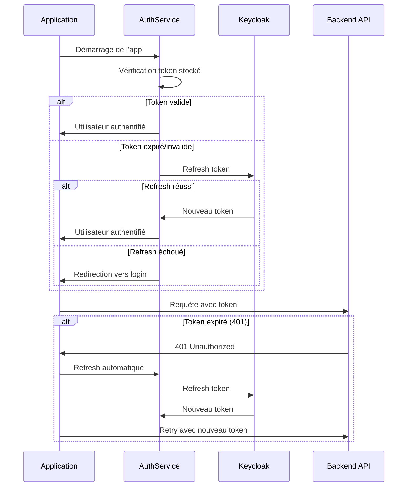

# 🔧 Guide Technique - LN FOOT Shop

## 📋 Vue d'Ensemble de l'Architecture

### Stack Technologique
- **Framework** : Flutter 3.x
- **Langage** : Dart
- **Authentification** : Keycloak avec `keycloak_wrapper`
- **Gestion d'État** : BLoC Pattern (`flutter_bloc`)
- **API** : REST API générée avec OpenAPI
- **Stockage** : Flutter Secure Storage
- **HTTP Client** : Custom RefreshingHttpClient

### Architecture Générale
```
┌─────────────────┐    ┌─────────────────┐    ┌─────────────────┐
│   Presentation  │    │    Business     │    │      Data       │
│     Layer       │◄──►│     Logic       │◄──►│     Layer       │
│   (Widgets)     │    │   (BLoC/Cubit)  │    │ (Services/API)  │
└─────────────────┘    └─────────────────┘    └─────────────────┘
```

## 🏗️ Structure du Projet

### Organisation des Dossiers
```
lib/
├── bloc/                    # Gestion d'état BLoC
│   ├── auth/               # Authentification
│   ├── cart/               # Panier
│   ├── product/            # Produits
│   └── ...
├── screen/                 # Écrans principaux
├── widgets/                # Composants réutilisables
├── service/                # Services métier
├── model/                  # Modèles de données
├── theme/                  # Thèmes et styles
└── utils/                  # Utilitaires
```

## 🔐 Système d'Authentification

### Flux d'Authentification Keycloak



### AuthService - Fonctionnalités Clés

#### 1. Initialisation
```dart
static Future<AuthService> create() async {
  final wrapper = KeycloakWrapper(
    config: KeycloakConfig(
      bundleIdentifier: 'com.lnfoot',
      clientId: 'ln-foot-01', 
      frontendUrl: 'https://auth.ln-foot.com',
      realm: 'lnfoot',
    ),
  );
  await wrapper.initialize();
  return AuthService._(wrapper);
}
```

#### 2. Validation JWT
```dart
Future<bool> isTokenValid() async {
  // Décode le JWT et vérifie l'expiration
  // Buffer de 2 minutes avant expiration réelle
}
```

#### 3. Refresh Intelligent
```dart
Future<bool> refreshTokenIfNeeded() async {
  if (await isTokenValid()) return true;
  return await refreshToken();
}
```

#### 4. Planification Automatique
```dart
void scheduleTokenRefresh(int expiresInSeconds, String refreshTokenValue) {
  // Planifie le refresh 2 minutes avant expiration
  // Minimum 1 minute, maximum durée du token
}
```

### AuthBloc - États et Événements

#### États Principaux
```dart
abstract class AuthState {}
class AuthInitial extends AuthState {}
class AuthLoading extends AuthState {}
class Authenticated extends AuthState {
  final Map<String, dynamic> user;
}
class AuthenticatedWithToken extends AuthState {
  final String token;
}
class Unauthenticated extends AuthState {}
class AuthError extends AuthState {
  final String message;
}
```

#### Événements Principaux
```dart
abstract class AuthEvent {}
class AppStarted extends AuthEvent {}
class LoginRequested extends AuthEvent {}
class LogoutRequested extends AuthEvent {}
class CheckTokenStored extends AuthEvent {}
class CheckToken extends AuthEvent {}
```

## 🌐 Gestion des Requêtes HTTP

### RefreshingHttpClient

Intercepteur automatique pour la gestion des tokens :

#### Fonctionnalités
1. **Ajout automatique** du token Bearer à chaque requête
2. **Détection des erreurs 401** (Unauthorized)
3. **Refresh automatique** des tokens expirés
4. **Retry automatique** des requêtes échouées
5. **Gestion des erreurs** de refresh

#### Workflow
```dart
@override
Future<http.StreamedResponse> send(http.BaseRequest request) async {
  // 1. Refresh préventif si nécessaire
  await authService.refreshTokenIfNeeded();
  
  // 2. Ajout du token à la requête
  final token = await authService.getAccessToken();
  if (token != null) {
    request.headers['Authorization'] = 'Bearer $token';
  }
  
  // 3. Envoi de la requête
  final response = await _inner.send(request);
  
  // 4. Gestion du 401
  if (response.statusCode == 401) {
    final refreshed = await authService.refreshToken();
    if (refreshed) {
      // Retry avec nouveau token
      final newRequest = _copyRequest(request);
      return _inner.send(newRequest);
    }
  }
  
  return response;
}
```

## 🔄 Gestion d'État avec BLoC

### Pattern BLoC Utilisé

#### Structure Type
```dart
class ProductBloc extends Bloc<ProductEvent, ProductState> {
  final ProductService productService;
  
  ProductBloc({required this.productService}) : super(ProductInitial()) {
    on<LoadProducts>(_onLoadProducts);
    on<RefreshProducts>(_onRefreshProducts);
  }
  
  Future<void> _onLoadProducts(
    LoadProducts event, 
    Emitter<ProductState> emit,
  ) async {
    emit(ProductLoading());
    try {
      final products = await productService.getProducts();
      emit(ProductLoaded(products));
    } catch (e) {
      emit(ProductError(e.toString()));
    }
  }
}
```

#### Injection de Dépendances
```dart
MultiBlocProvider(
  providers: [
    BlocProvider(create: (context) => AuthBloc(authService: authService)),
    BlocProvider(create: (context) => ProductBloc(productService: productService)),
    BlocProvider(create: (context) => CartBloc()),
    // ...
  ],
  child: MaterialApp(...)
)
```

## 📱 Navigation et Écrans

### AuthWrapper - Routage Conditionnel

```dart
BlocBuilder<AuthBloc, AuthState>(
  builder: (context, state) {
    switch (state.runtimeType) {
      case AuthInitial:
      case AuthLoading:
        return SplashScreen(apiClient: apiClient);
      
      case Authenticated:
      case AuthenticatedWithToken:
        return const HomeScreen();
      
      case AuthError:
        // Affichage erreur + redirection login
        return LoginOptionsScreen();
      
      case Unauthenticated:
      default:
        return LoginOptionsScreen();
    }
  },
)
```

### Gestion des États de Réseau

```dart
BlocBuilder<NetworkBloc, NetworkState>(
  builder: (context, networkState) {
    if (networkState is NetworkOffline) {
      return const OfflinePage();
    }
    return AuthWrapper(apiClient: apiClient);
  },
)
```

## 🛠️ Configuration et Déploiement

### Variables d'Environnement

#### Keycloak
```dart
KeycloakConfig(
  bundleIdentifier: 'com.lnfoot',
  clientId: 'ln-foot-01',
  frontendUrl: 'https://auth.ln-foot.com',
  realm: 'lnfoot',
)
```

#### API Backend
```dart
// Configuration dans openapi_generator_config.json
{
  "packageName": "lnFoot_api",
  "generatorName": "dart",
  "outputDir": "api/lnFoot_api"
}
```

### Sécurité

#### Stockage Sécurisé
- **FlutterSecureStorage** pour les tokens
- **Chiffrement automatique** selon la plateforme
- **Nettoyage automatique** à la déconnexion

#### Validation des Tokens
- **Décodage JWT** pour vérification locale
- **Buffer temporel** avant expiration
- **Révocation automatique** en cas d'erreur

## 🧪 Tests

### Tests Unitaires Recommandés

#### AuthService
```dart
group('AuthService Tests', () {
  test('should validate token correctly', () async {
    // Test de validation JWT
  });
  
  test('should refresh token when needed', () async {
    // Test de refresh conditionnel
  });
});
```

#### BLoC Tests
```dart
blocTest<AuthBloc, AuthState>(
  'should emit Authenticated when login succeeds',
  build: () => AuthBloc(authService: mockAuthService),
  act: (bloc) => bloc.add(LoginRequested()),
  expect: () => [AuthLoading(), Authenticated(user)],
);
```

## 📊 Monitoring et Debugging

### Logs Recommandés
```dart
// Dans AuthService
debugPrint('Token expire dans : $expiresInSeconds secondes');
debugPrint('Refresh automatique planifié dans ${duration.inMinutes} minutes');

// Dans RefreshingHttpClient  
debugPrint('RefreshingHttpClient: ${request.method} ${request.url}');
debugPrint('RefreshingHttpClient: Status ${response.statusCode}');
```

### Métriques à Surveiller
- Taux de réussite des refresh tokens
- Fréquence des erreurs 401
- Temps de réponse API
- Crashes liés à l'authentification

## 🔧 Dépannage Technique

### Problèmes Courants

#### 1. Token Refresh en Boucle
**Cause** : Logic de validation incorrecte
**Solution** : Vérifier `isTokenValid()` avec buffer approprié

#### 2. Erreurs 401 Persistantes  
**Cause** : RefreshingHttpClient mal configuré
**Solution** : Vérifier l'injection du service dans ApiClient

#### 3. Navigation Bloquée
**Cause** : États BLoC non gérés
**Solution** : Vérifier tous les cas dans AuthWrapper

#### 4. Performance Dégradée
**Cause** : Trop de refresh préventifs
**Solution** : Optimiser `refreshTokenIfNeeded()`

## 📚 Ressources Externes

### Documentation
- [Flutter BLoC](https://bloclibrary.dev/)
- [Keycloak Wrapper](https://pub.dev/packages/keycloak_wrapper)
- [Flutter Secure Storage](https://pub.dev/packages/flutter_secure_storage)

### Outils de Développement
- **OpenAPI Generator** pour la génération d'API
- **Flutter Inspector** pour le debugging UI
- **Dart DevTools** pour l'analyse de performance

---

*Guide technique mis à jour le 3 juin 2025 - Version 1.0*
