# 📊 Analyse UML - LN FOOT Shop

## 🎯 Vue d'Ensemble du Projet

**LN FOOT** est une application mobile e-commerce développée en Flutter pour la vente d'équipements sportifs. L'application utilise une architecture moderne basée sur le pattern BLoC pour la gestion d'état et intègre Keycloak pour l'authentification.

### Fonctionnalités Principales
- 🔐 Système d'authentification complet (login, signup, mot de passe oublié, OTP)
- 🛍️ Catalogue de produits avec catégories et recherche
- 🛒 Panier d'achat et système de commande
- ⭐ Système de reviews et d'évaluations
- 👤 Gestion de profil utilisateur
- 💾 Sauvegarde d'articles favoris
- 🌐 Gestion de l'état réseau (online/offline)

---

## 📋 1. Diagrammes de Cas d'Usage (Use Cases)

### 1.1 Acteurs du Système

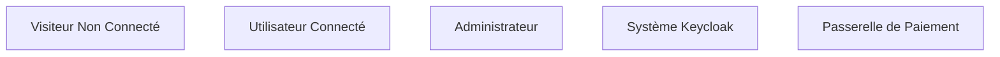

### 1.2 Cas d'Usage - Authentification

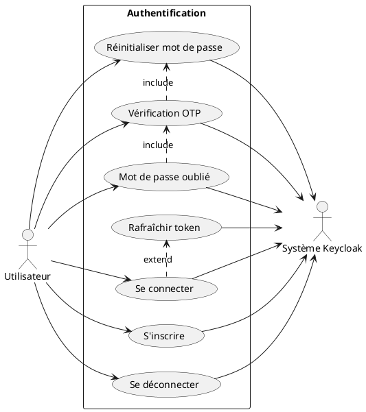

### 1.3 Cas d'Usage - E-Commerce

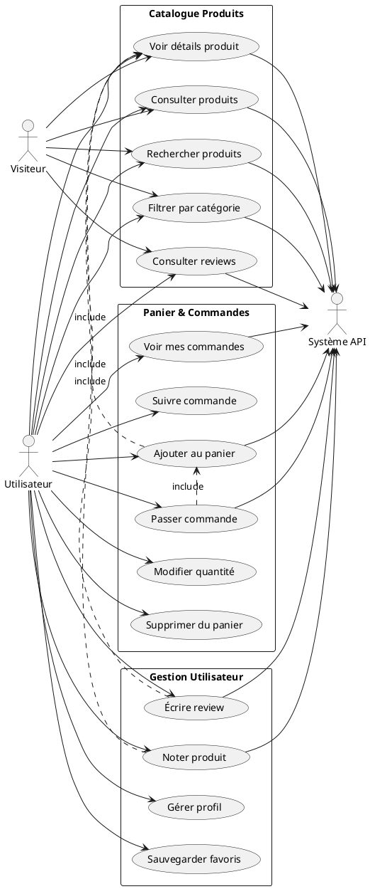

---

## 🔄 2. Diagrammes de Séquence

### 2.1 Séquence d'Authentification OAuth

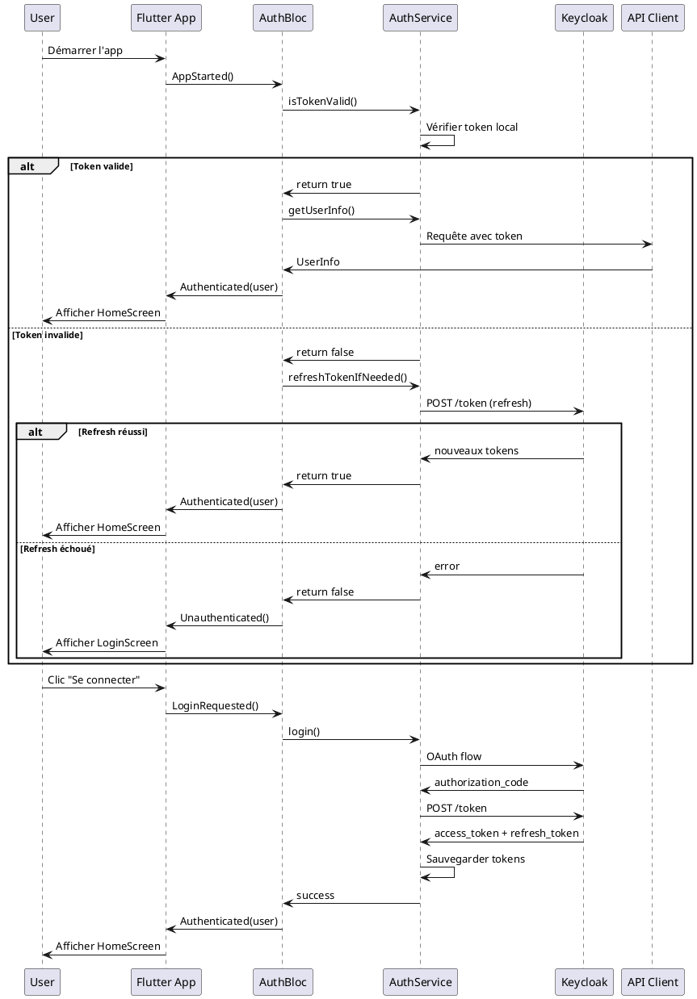

### 2.2 Séquence d'Ajout au Panier

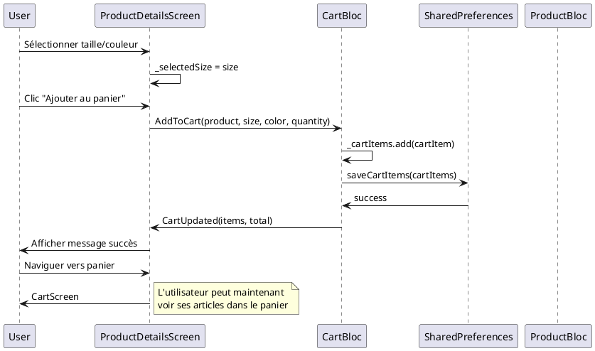

### 2.3 Séquence de Commande

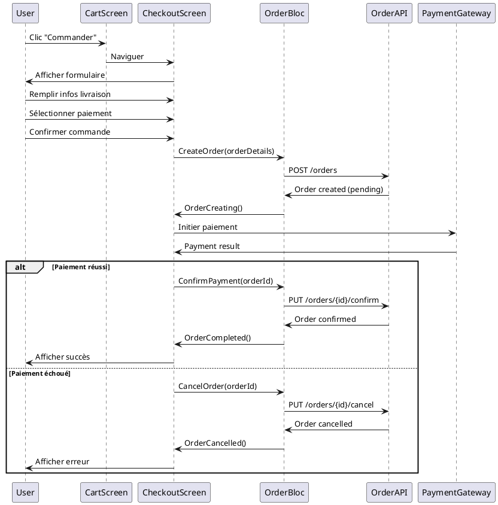

---

## 📊 3. Diagrammes d'Activité

### 3.1 Processus d'Authentification

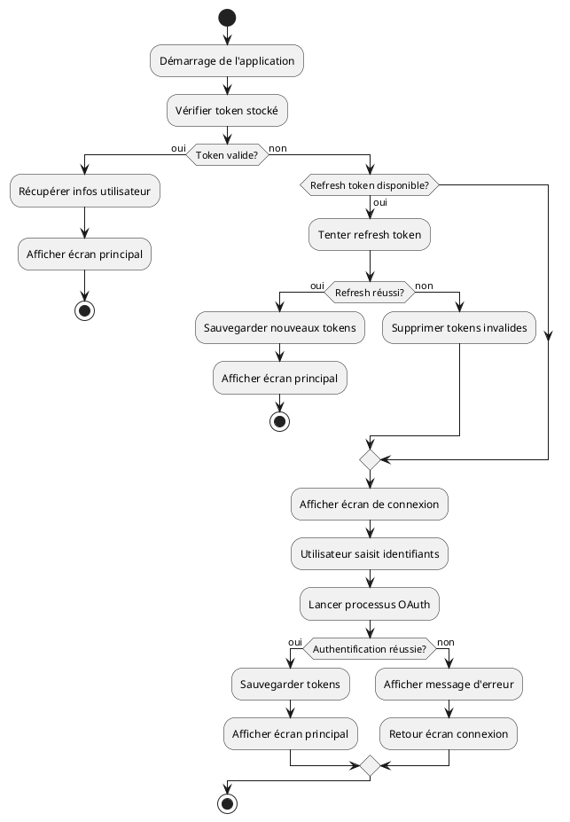

### 3.2 Processus d'Achat

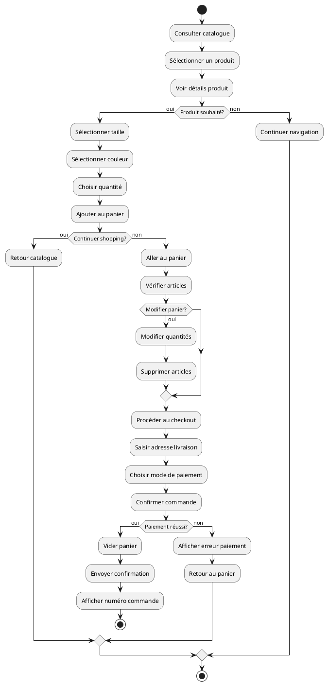

### 3.3 Gestion des Reviews

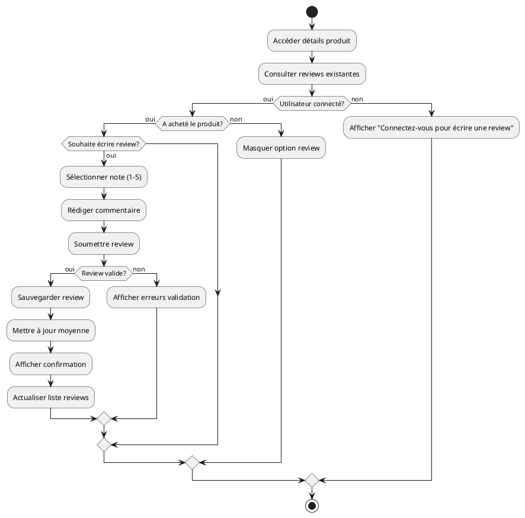

---

## 🏗️ 4. Diagrammes de Classes

### 4.1 Architecture BLoC - Gestion d'État

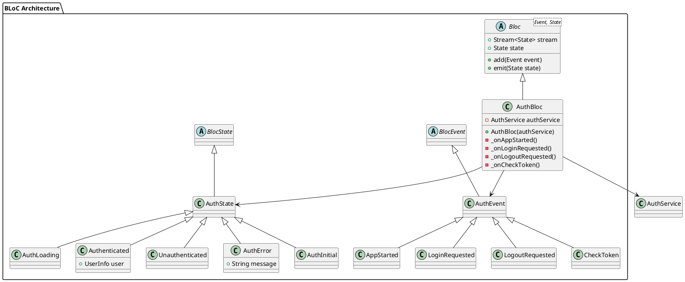

### 4.2 Entités Métier Principales

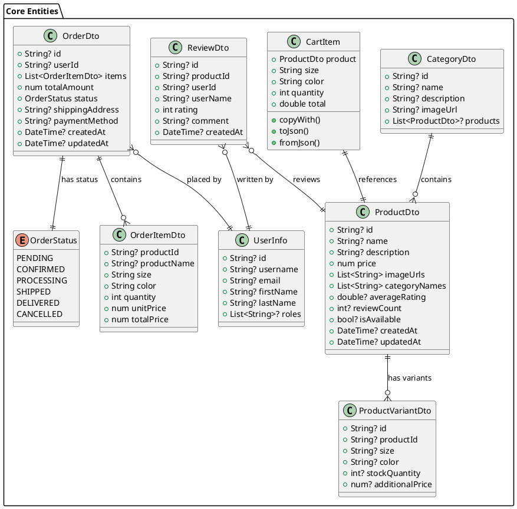

### 4.3 Architecture des Services

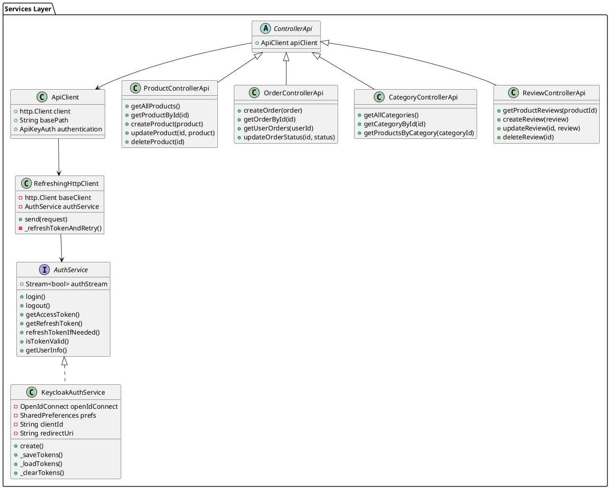

### 4.4 Architecture UI - Screens et Widgets

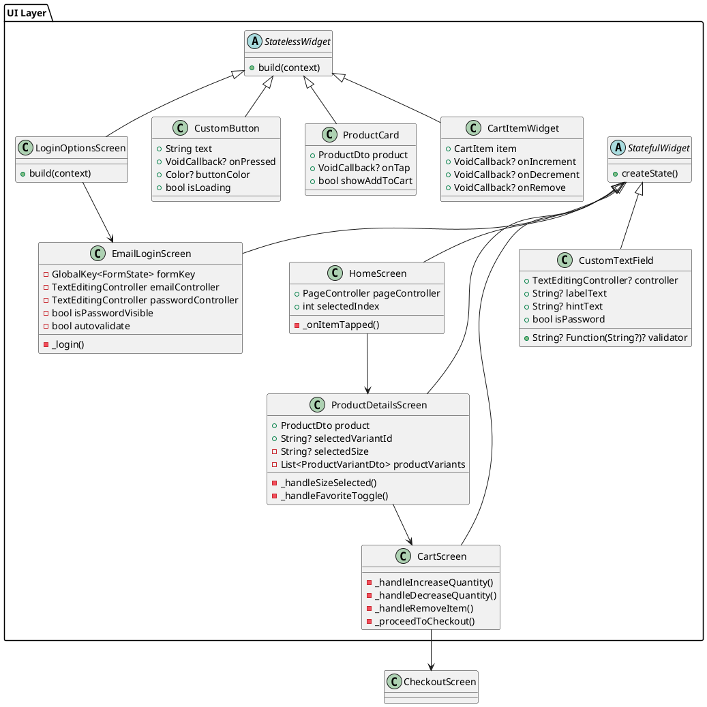

---

## 🔄 5. Flux de Données et Architecture

### 5.1 Architecture Globale

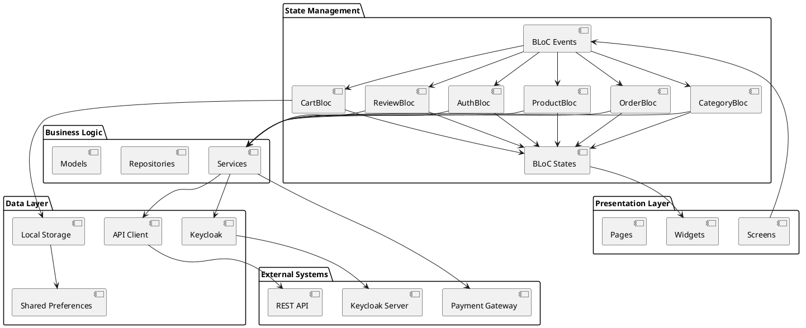

### 5.2 Cycle de Vie d'une Requête

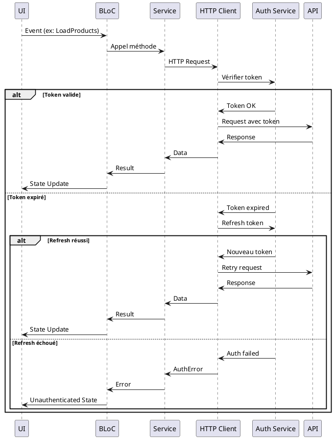

---

## 📱 6. Interfaces Utilisateur et Navigation

### 6.1 Flow de Navigation Principal

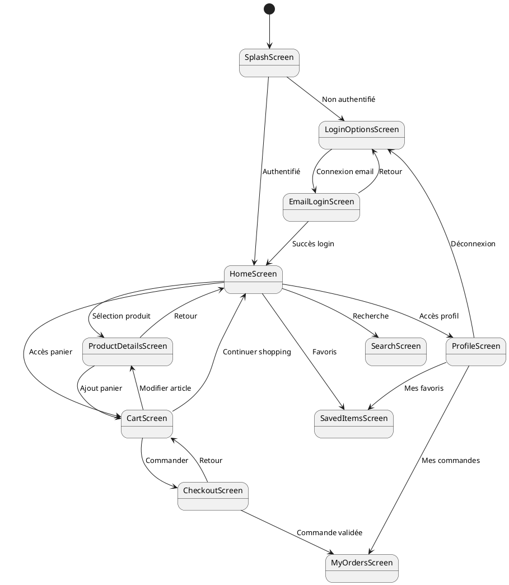

### 6.2 Structure des Widgets Réutilisables

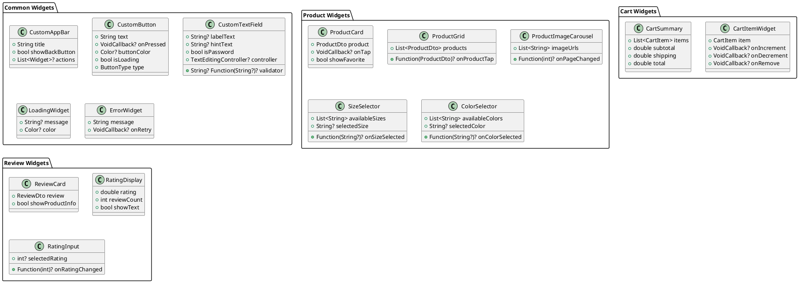

---

## 🔧 7. Gestion des Erreurs et États

### 7.1 Hiérarchie des États BLoC

```plantuml
@startuml
abstract class BlocState

package "Auth States" {
  class AuthInitial extends BlocState
  class AuthLoading extends BlocState
  class Authenticated extends BlocState {
    +UserInfo user
  }
  class Unauthenticated extends BlocState
  class AuthError extends BlocState {
    +String message
  }
  class AuthLoggingOut extends BlocState
}

package "Product States" {
  class ProductInitial extends BlocState
  class ProductLoading extends BlocState
  class ProductLoaded extends BlocState {
    +List<ProductDto> products
    +String? searchQuery
    +String? selectedCategory
  }
  class ProductError extends BlocState {
    +String message
  }
  class ProductDetailsLoaded extends BlocState {
    +ProductDto product
    +List<ProductVariantDto> variants
  }
}

package "Cart States" {
  class CartInitial extends BlocState
  class CartLoading extends BlocState
  class CartLoaded extends BlocState {
    +List<CartItem> items
    +double total
    +int itemCount
  }
  class CartError extends BlocState {
    +String message
  }
}

package "Order States" {
  class OrderInitial extends BlocState
  class OrderCreating extends BlocState
  class OrderCreated extends BlocState {
    +OrderDto order
  }
  class OrdersLoaded extends BlocState {
    +List<OrderDto> orders
  }
  class OrderError extends BlocState {
    +String message
  }
}
@enduml
```

### 7.2 Gestion des Erreurs Réseau

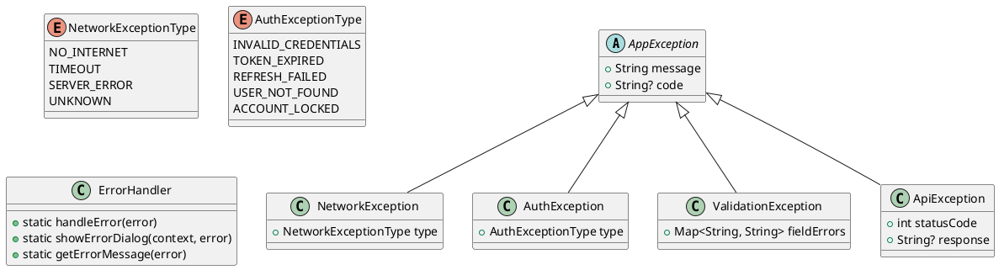

---

## 🔄 8. Patterns et Bonnes Pratiques

### 8.1 Repository Pattern (Conceptuel)

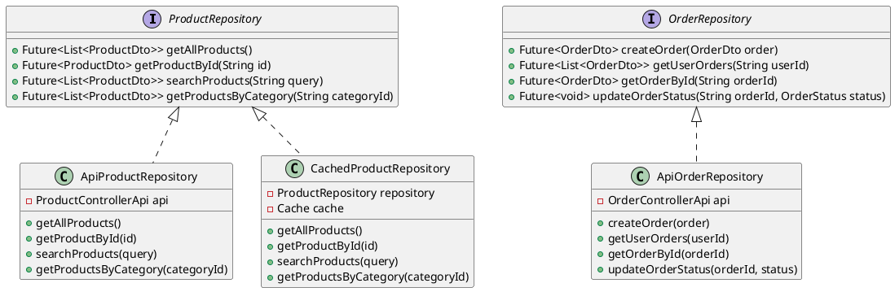

### 8.2 Dependency Injection

```plantuml
@startuml
class ServiceLocator {
  -Map<Type, dynamic> services
  +static T get<T>()
  +static register<T>(T service)
  +static registerLazySingleton<T>(Factory<T> factory)
}

class AppDependencies {
  +static setupDependencies()
  +static registerServices()
  +static registerRepositories()
  +static registerBlocs()
}

note right of AppDependencies
  Configure all dependencies
  at app startup:
  - API clients
  - Services
  - Repositories
  - BLoCs
end note
@enduml
```

---

## 📋 9. Résumé et Points Clés

### Points Forts de l'Architecture

1. **Séparation des Responsabilités**
   - Couche UI distincte avec widgets réutilisables
   - BLoC pour la gestion d'état centralisée
   - Services pour la logique métier
   - Clients API pour l'accès aux données

2. **Gestion Robuste de l'Authentification**
   - Integration OAuth/OpenID Connect via Keycloak
   - Refresh automatique des tokens
   - Gestion des états d'authentification

3. **Architecture Réactive**
   - Pattern BLoC pour la gestion d'état
   - Streams pour la communication asynchrone
   - États immutables avec Equatable

4. **Persistence Locale**
   - SharedPreferences pour les préférences utilisateur
   - Sauvegarde locale du panier
   - Cache des données critiques

### Améliorations Possibles

1. **Repository Pattern**
   - Abstraire davantage l'accès aux données
   - Implémenter un cache sophistiqué
   - Gestion offline-first

2. **Testing**
   - Tests unitaires pour tous les BLoCs
   - Tests d'intégration pour les workflows
   - Tests de widgets UI

3. **Performance**
   - Lazy loading des images
   - Pagination des listes de produits
   - Optimisation des requêtes API

4. **Monitoring**
   - Logging centralisé
   - Analytics des performances
   - Crash reporting

Cette architecture UML représente une application Flutter moderne, bien structurée, qui suit les meilleures pratiques du développement mobile et offre une base solide pour l'évolutivité et la maintenance.